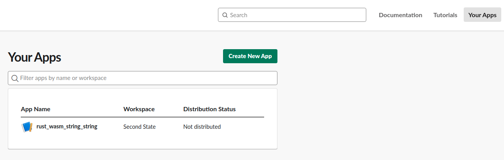
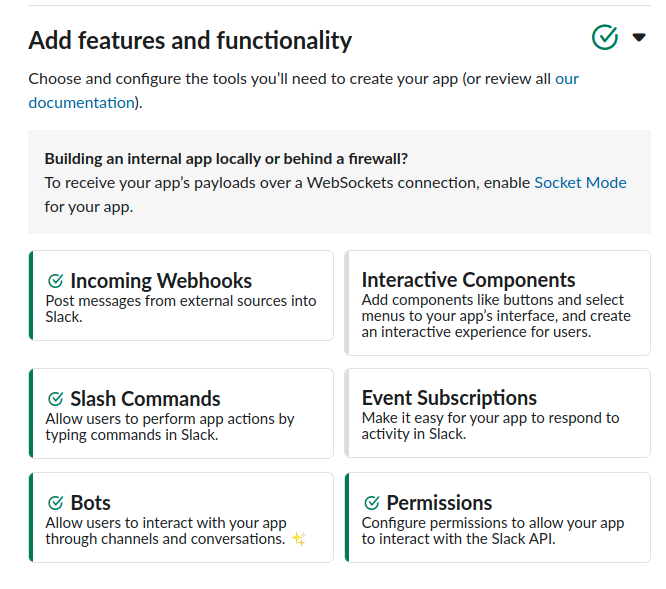
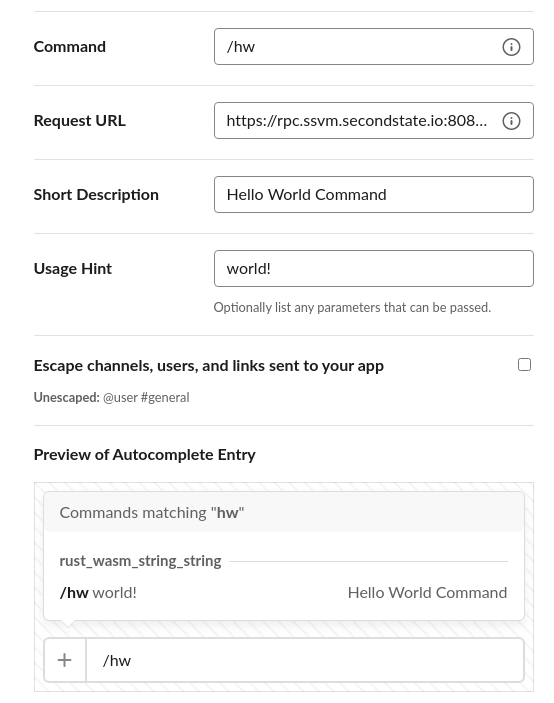
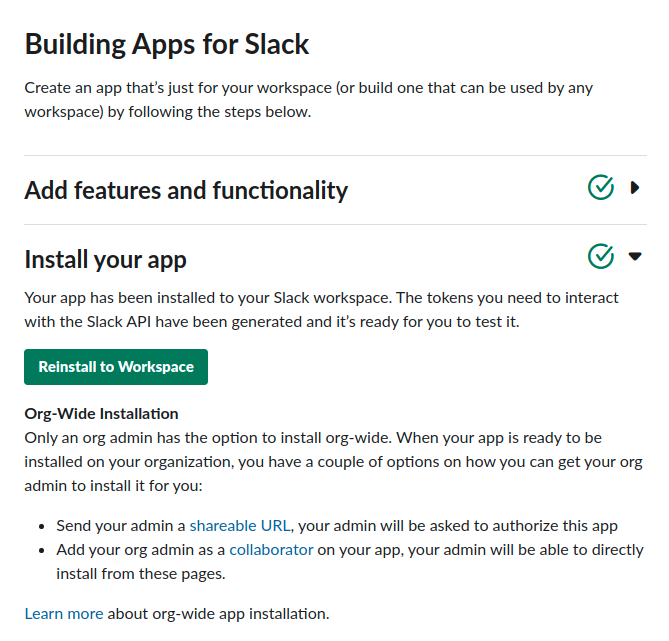
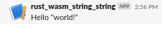

# The hello example

In this example, we demonstrate how to create a Slack App which can take content from a channel, execute some logic as Rust/Wasm on SSVM, and then return the result (in a Bot-like fashion) to the original messenger/user (as a response in that same channel)

## Prerequisites

If you have not done so already, follow these simple instructions to install [Rust](https://www.rust-lang.org/tools/install) and [ssvmup](https://www.secondstate.io/articles/ssvmup/).

## Start a new project

You can start a brand new project if you want. 
```
cargo new --lib your_project_name
```
**Or** you can just clone this wasm-learning repo and build and deploy our existing projects from your machine.
```
git clone https://github.com/second-state/wasm-learning
```

## Write Rust code

Below is the entire content of the [src/lib.rs](src/lib.rs) file.

```
use wasm_bindgen::prelude::*;
use serde_json::{Value};


#[wasm_bindgen]
pub fn say(slack_object_as_string: &str) -> String {
  let hello_prefix = String::from("Hello ");
  let json_object_from_slack: Value = serde_json::from_str(&slack_object_as_string).unwrap();
  let hello_suffix: String = json_object_from_slack["text"].to_string();
  return hello_prefix + &hello_suffix;
}
```

Before compiling, make sure that your `Cargo.toml` file has declared the correct dependencies and a `[lib]` section which identifies the crate-type, as shown below.

```
[lib]
name = "hello_lib"
path = "src/lib.rs"
crate-type =["cdylib"]

# See more keys and their definitions at https://doc.rust-lang.org/cargo/reference/manifest.html

[dependencies]
wasm-bindgen = "=0.2.61"
serde_json = "1.0"
```

## Build the WASM bytecode

```
$ ssvmup build
```

## FaaS

Upload the wasm file in the `pkg` folder to the FaaS. Double check the `.wasm` file name before you upload.

```
curl --location --request POST 'https://rpc.ssvm.secondstate.io:8081/api/executables' \
--header 'Content-Type: application/octet-stream' \
--header 'SSVM-Description: say hello' \
--data-binary '@pkg/hello_lib_bg.wasm'
```

Returns

```
{"wasm_id":368,"wasm_sha256":"0xfb413547a8aba56d0349603a7989e269f3846245e51804932b3e02bc0be4b665","usage_key":"00000000-0000-0000-0000-000000000000","admin_key":"00xxxxxx-xxxx-xxxx-xxxx-4adc960fd2b8"}
```

## Slack

In order to make Slack call SecondState's FaaS infrastructure, we need to allow Slack to make outgoing calls (an outgoing callback to a specific custom URL endpoint i.e. the term webhook). Unfortuately, outgoing webhooks are a legacy feature of Slack. Slack strongly recommends that users do not use legacy custom integrations anymore [1]

Thankfully we can create a [Slack App](https://api.slack.com/apps) which will allow us to define any behaviour and therefore interact with SecondState's FaaS infrastructure.



Once you have created a generic Slack App. click on it to open up some available options. If you expand the "Add features and functionality" section, you will see an option to create "Slash Commands".



The Slash Command is the easiest one to start with, we will also try some other event triggers later on (but they require a bit of to-and-fro with initializing secret keys and so forth).

Once you have compiled and deployed your Wasm executable (as shown above) you will have received your Wasm Id. Please go ahead and create the request URL, as shown below. In this case something like `https://rpc.ssvm.secondstate.io:8081/api/run/368/say` is added to our `/hw` (hello world) Slash Command section.




Go ahead and install the Slack App so we can try it out



Now if we go to the channel where we installed our Slack App and type `/hw world!`


We will see that the Slack App sends the webhook to SecondState's Faas (runs the logic in your Rust `lib.rs` file) and then returns the response to our channel in a bit-like fashion.



[1] https://api.slack.com/legacy/custom-integrations/outgoing-webhooks
[2] https://api.slack.com/apis/connections/events-api
