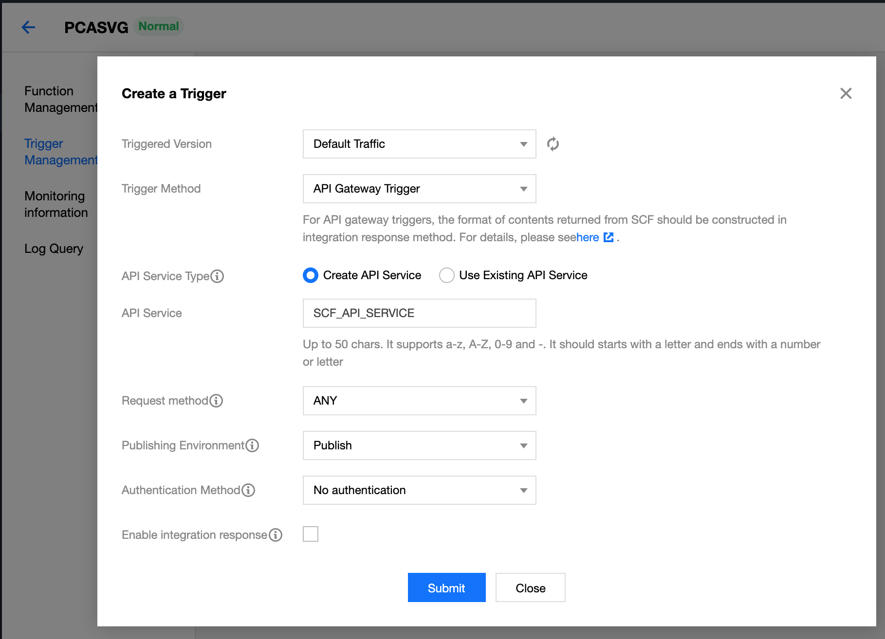
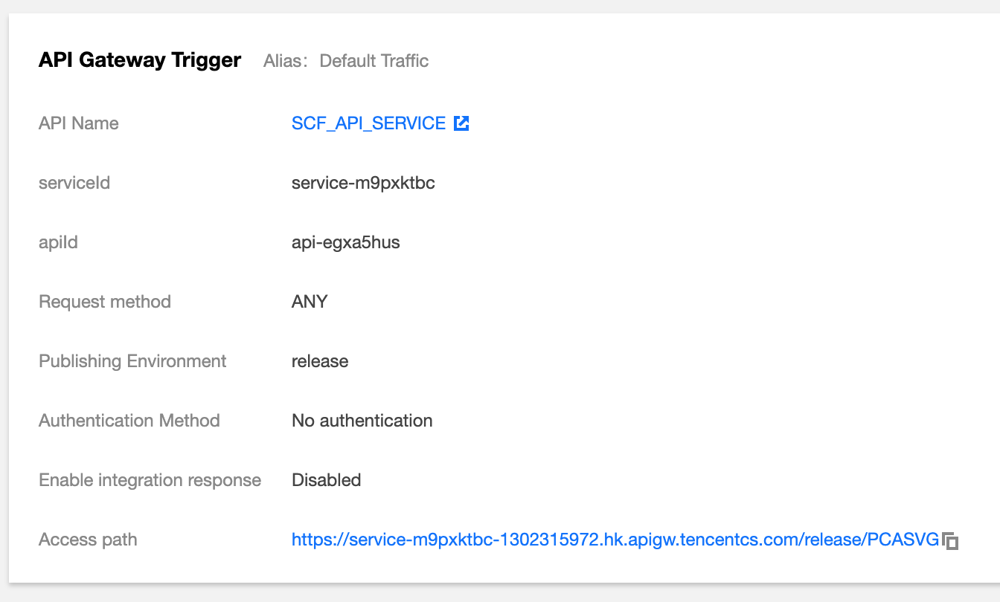

# The Principal Component Analysis (PCA) + SVG example

In this example, we demonstrate how to do Principal Component Analysis (PCA) of a 2-D data array, and then plot the results in an SVG graph. Checkout the [live example here](https://www.secondstate.io/demo/2020-tencentcloud.html).

> To draw SVG graphs in Rust, we used the techniques described by [Cetra](https://cetra3.github.io/blog/) in [this article](https://cetra3.github.io/blog/drawing-svg-graphs-rust/).

## Prerequisites

If you have not done so already, follow these simple instructions to [install ssvmup](https://www.secondstate.io/articles/ssvmup/) on your development computer.

## Build the WASM bytecode

```
$ ssvmup build
```

## Package for deployment

```
$ cp pkg/pca_bg.wasm cloud/
$ cd cloud
$ zip pca.zip *
```

## Deploy on TencentCloud

[Follow the instructions here](https://github.com/second-state/ssvm-tencent-starter/blob/master/README.md#deploy-on-tencentcloud). Make sure that the "execution handler" is set to `pca_bg.wasm` in the web console.

## Create a web service

Go to Trigger Management, and Create Trigger. Select API Gateway Trigger from the list, and Submit.



Copy down the access path URL once the web API trigger is created.



## Test

Next, go to the `test` folder and use `curl` to post a CSV data file to the access path URL. It should return a SVG graph plotting the input 2D points as well as the two principal components.

```
$ cd test
$ curl -d @iris.csv -X POST https://service-m9pxktbc-1302315972.hk.apigw.tencentcs.com/release/PCASVG
```

## Web app

With this serverless function available at the access path URL, we can now build a web page front end for it. The web page is just HTML and JavaScript, and can be hosted on any computer, including your local laptop, and hence is truly serverless. The web page uses JavaScript to make requests for PCA computation and SVG drawing from the cloud function.

[Live web page](https://www.secondstate.io/demo/2020-tencentcloud.html) | [HTML source code](https://github.com/second-state/www/blob/master/themes/hugo-notepadium/static/demo/2020-tencentcloud.html)

Note: You must [enable CORS](https://www.secondstate.io/articles/tencentcloud-api-gateway-cors/) on the Tencent serverless cloud function's API gateway in order for the JavaScript AJAX calls to succeed.

